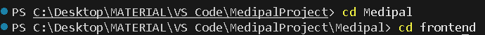
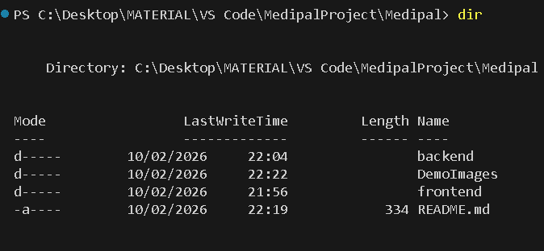
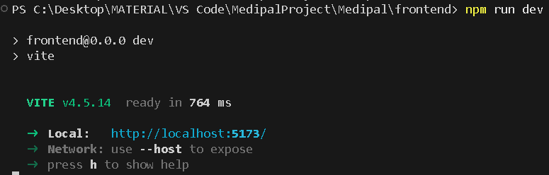
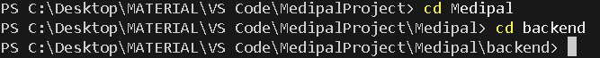
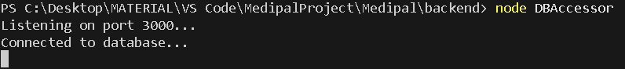

# MEDIPAL
Health tracking web application.

## FRONTEND
### Background
This section primarily handles the user interface, inputs and interactions.
Uses Node and React + Vite.

### Execution
To run the web application:  
1. Use the terminal, navigate to the folder "frontend".  

Tip: Use command "dir" to find where you are.  

2. Write "npm run dev" into terminal.  

Note: If this is your first time, write "npm install" to install missing dependencies.   

3. To close connect hold "ctrl" + "c".  

## BACKEND
### Background  
This section currently primarily handles the database and API's.  
Uses Node and SQLite.  

Listening port: 3000  
URL: http://localhost:3000  

### Execution  
To open database connection:  
1. Use the terminal, navigate to the folder "backend".  

Tip: Use command "dir" to find where you are.  

2. Write "node DBAccessor" into terminal.  

The response message should look similar to the above.  

3. To close connect hold "ctrl" + "c".  
