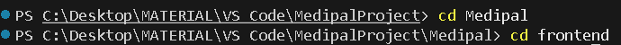
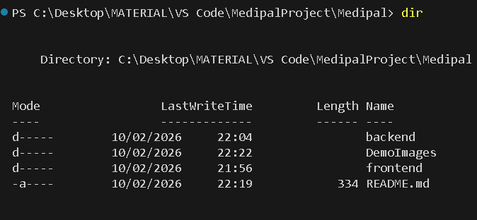
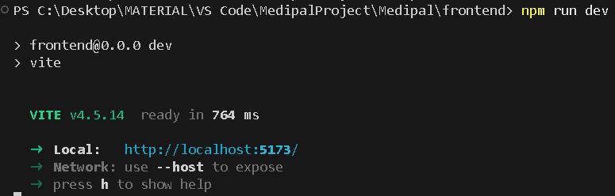
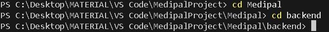
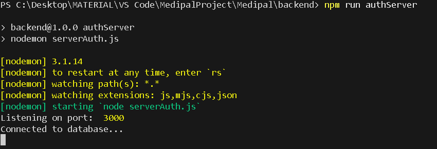
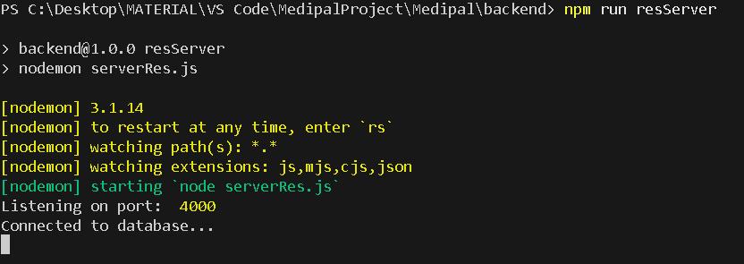

# MEDIPAL
Health tracking web application.

## FRONTEND
### Background
This section primarily handles the user interface, inputs and interactions.
Uses Node and React + Vite.

### Execution
To run the web application:  
1. Use the terminal, navigate to the folder "frontend".  

Tip: Use command "dir" to find where you are.  

2. Write "npm run dev" into terminal.  

Note: If this is your first time, write "npm install" to install missing dependencies.   

3. To close connect hold "ctrl" + "c".  

## BACKEND
### Background  
This section currently primarily handles the database and APIs.  
Uses Node, Express and SQLite.  

Authentication Server:  
Listening port: 3000   
URL: http://localhost:3000   
DESC: Handles user authentication and creation/deletion of tokens.  
CMD: npm run authServer 

Resource Server:  
Listening port: 4000   
URL: http://localhost:4000    
DESC: Handles retrieval of user data from database.  
CMD: npm run resServer 

### Execution  
To open server APIs:  
1. Use the terminal, navigate to the folder "backend".  

Tip: Use command "dir" to find where you are.  

2. Write the CMD for whichever server you need. 

The response message should look similar to the above.   

3. To close connect hold "ctrl" + "c".  
